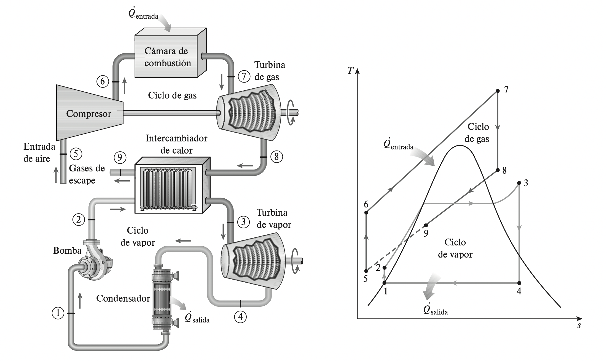

Considere el ciclo de potencia combinado de gas y vapor mostrado en la figura 10-27. El ciclo superior es un ciclo de turbina de gas que tiene una rela- ción de presión de 8. El aire entra al compresor a 300 K y a la turbina a 1 300 K. La eficiencia isentrópica del compresor es de 80 por ciento, mientras que la de la turbina de gas es de 85 por ciento. El ciclo inferior es un ciclo Rankine ideal simple que opera entre los límites de presión de 7 MPa y 5 kPa. El vapor se calienta en un intercambiador de calor por medio de los gases de escape hasta una temperatura de 500 °C. Los gases de escape salen del intercambia- dor de calor a 450 K. Determine a) la relación entre los flujos másicos del va- por y de los gases de combustión y b) la eficiencia térmica del ciclo combinado.

