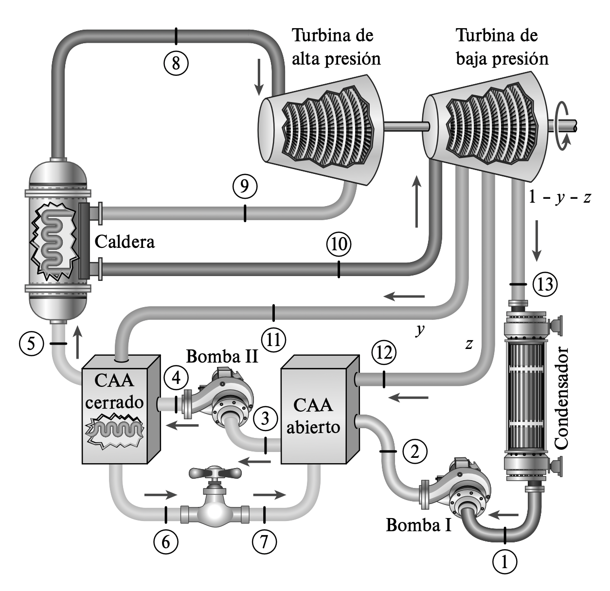

# Problema 10 -110

Una planta termoeléctrica de vapor opera en un ciclo Rankine regenerativo ideal con un recalentador y dos calentado­ res de agua de alimentación, uno abierto y otro cerrado. El va­ por entra a la turbina de alta presión a 15 MPa y 600 °C y a la turbina de baja presión a 1 MPa y 500 °C. La presión del con­ densador es de 5 kPa. El vapor se extrae de la turbina a 0.6 MPa para el calentador cerrado y a 0.2 MPa para el calentador abier­ to. En el calentador cerrado, el agua de alimentación es calienta a la temperatura de condensación del vapor extraído. El vapor extraído sale del calentador cerrado como líquido saturado, que después se estrangula y va al calentador abierto. Muestre el ciclo en un diagrama T-s­con respecto a las líneas de saturación. De­ termine a) la fracción de vapor extraído de la turbina hacia el calentador abierto, b) la eficiencia térmica del ciclo y c) la po­ tencia neta producida para un flujo másico de 42 kg/s a través de la caldera.

